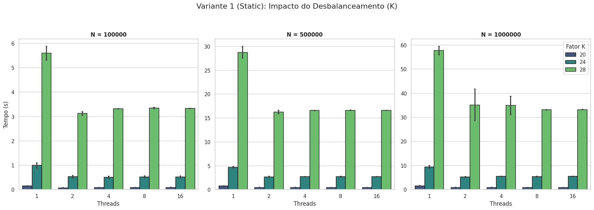
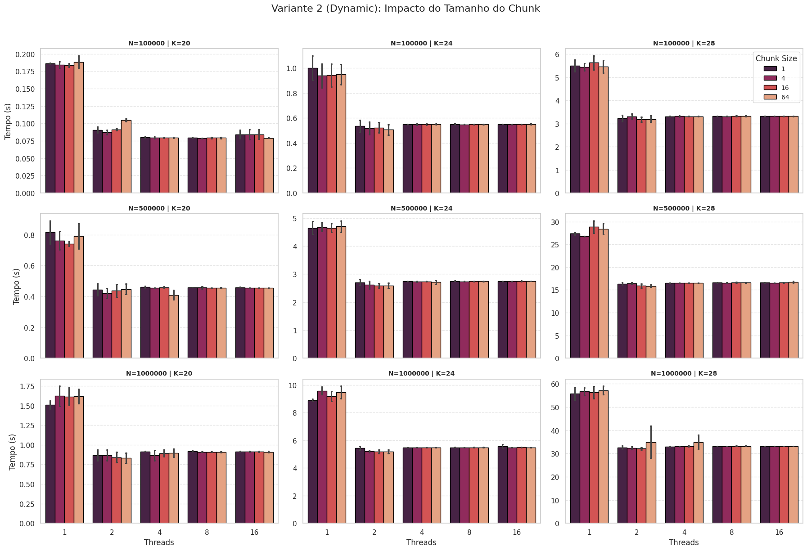
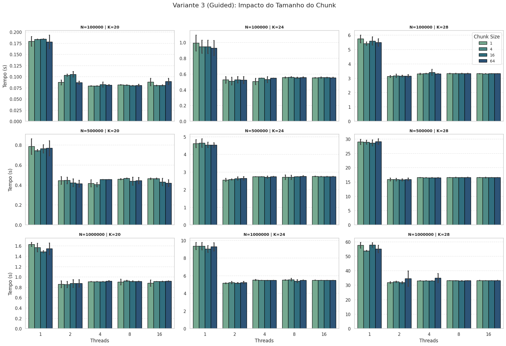

# Análise dos Resultados Experimentais

Este documento apresenta a discussão sobre o desempenho das três estratégias de escalonamento do OpenMP (Static, Dynamic e Guided) aplicadas ao cálculo da sequência de Fibonacci com carga de trabalho artificialmente desbalanceada. Os experimentos foram conduzidos variando-se o tamanho do vetor ($N$), o fator de complexidade ($K$) e o número de threads, com o objetivo de identificar o comportamento de escalabilidade e o impacto do custo administrativo (overhead) de gerenciamento em cada abordagem.

## Análise da Variante 1: Escalonamento Estático (Static)

O escalonamento estático divide o espaço de iterações em blocos de tamanho fixo determinados em tempo de compilação ou no início da execução, atribuindo-os às threads de maneira circular. A expectativa teórica para este modelo em cenários de carga desbalanceada é um desempenho inferior, visto que threads com tarefas mais leves terminariam antes e ficariam ociosas aguardando as threads sobrecarregadas.

## Análise da Variante 2: Escalonamento Dinâmico (Dynamic)

A estratégia dinâmica atribui tarefas às threads sob demanda durante a execução. As threads solicitam novos "chunks" (pedaços) de trabalho assim que concluem o anterior. Esta abordagem é ideal para corrigir desbalanceamentos de carga, mas introduz um custo de sincronização e comunicação para o gerenciamento da fila de tarefas, conhecido como overhead.

## Análise da Variante 3: Escalonamento Guiado (Guided)

O escalonamento guiado funciona como um híbrido adaptativo, iniciando com chunks grandes para reduzir o overhead e diminuindo o tamanho dos blocos progressivamente para refinar o balanceamento de carga no final da execução. Esta técnica visa oferecer o equilíbrio ideal, minimizando tanto a ociosidade quanto o custo de gerenciamento das threads.

## Conclusão Geral

A comparação direta entre as três variantes revelou um fenômeno interessante em relação à teoria clássica de Computação de Alto Desempenho. Embora os escalonadores `dynamic` e `guided` sejam projetados para superar o `static` em cargas irregulares, os experimentos mostraram que as três abordagens obtiveram tempos de execução finais extremamente similares, com diferenças marginais.

Essa paridade de desempenho pode ser atribuída às características estatísticas da carga de trabalho utilizada. A função de desbalanceamento baseada em módulo gera um padrão de esforço repetitivo e previsível. Em um espaço de iterações amplo ($N=10^6$), a probabilidade de uma thread receber uma fatia desproporcional de tarefas complexas é estatisticamente nula quando a distribuição é feita em blocos intercalados. Portanto, o escalonador estático beneficiou-se de um balanceamento global implícito, eliminando a necessidade do overhead de gerenciamento dinâmico. Conclui-se que, para cargas cíclicas e de alta granularidade, a simplicidade do escalonamento estático pode ser tão eficiente quanto algoritmos dinâmicos complexos, embora estes últimos permaneçam indispensáveis para cenários onde a irregularidade da carga seja concentrada ou não uniforme.