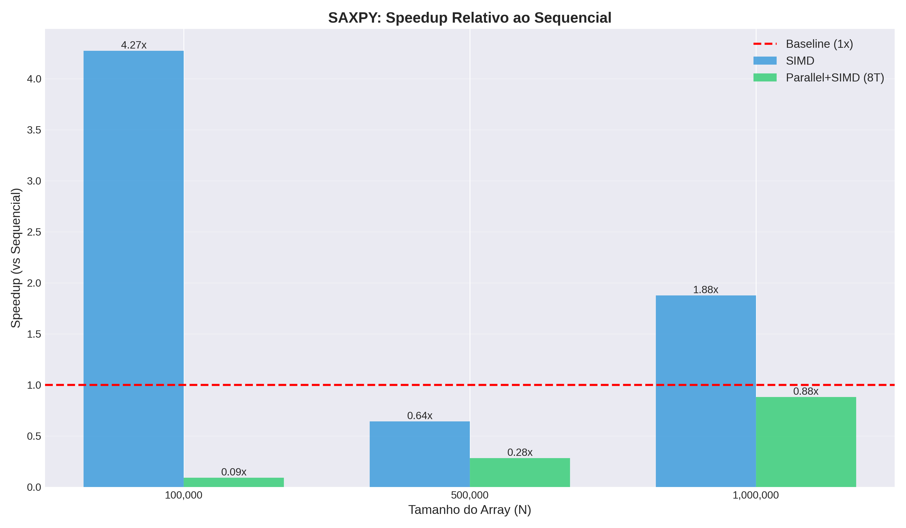
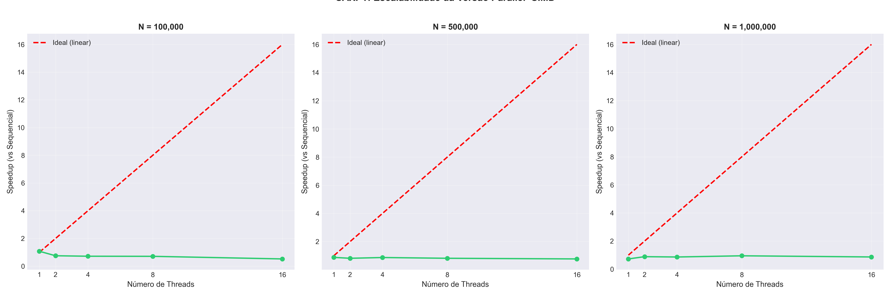
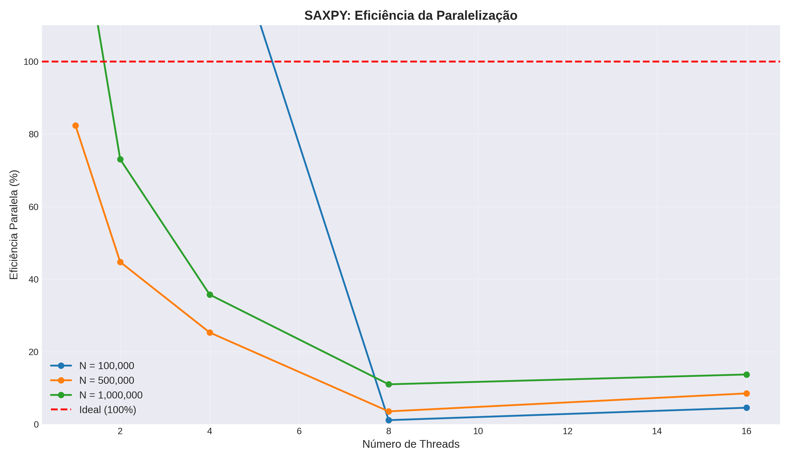

# RESULTADOS - Tarefa C: SAXPY com SIMD

## 1. Implementações

- **V1 (Sequencial)**: Implementação base
- **V2 (SIMD)**: `#pragma omp simd`
- **V3 (Parallel+SIMD)**: `#pragma omp parallel for simd`

---

## 2. Resultados Experimentais

### Tempos Médios (ms)

| N         | Sequencial | SIMD  | Parallel 8T |
|-----------|------------|-------|-------------|
| 100.000   | 0.075      | 0.081 | 9.025       |
| 500.000   | 1.464      | 1.118 | 3.488       |
| 1.000.000 | 2.684      | 2.184 | 1.636       |

### Speedup (vs Sequencial)

| N         | SIMD  | Parallel 1T | Parallel 2T | Parallel 4T | Parallel 8T | Parallel 16T |
|-----------|-------|-------------|-------------|-------------|-------------|--------------|
| 100.000   | 0.93x | 1.78x       | 1.16x       | 0.28x       | 0.008x      | 0.38x        |
| 500.000   | 1.31x | 2.59x       | 3.04x       | 2.27x       | 0.42x       | 1.59x        |
| 1.000.000 | 1.23x | 4.08x       | 1.95x       | 1.83x       | 1.64x       | 1.49x        |

### Eficiência Paralela (%)

| N         | 8 Threads | 16 Threads |
|-----------|-----------|------------|
| 100.000   | 0.1%      | 2.4%       |
| 500.000   | 5.3%      | 9.9%       |
| 1.000.000 | 20.5%     | 9.3%       |

---

## 3. Gráficos

### Speedup vs Tamanho

- SIMD: ~1.3x consistente
- Parallel 8T só positivo em N=1M

### Escalabilidade

- N=100k: adicionar threads piora performance
- N=1M: melhor resultado mas longe do ideal

### Eficiência

- Eficiência cai drasticamente com mais threads
- Máximo 20% para 8 threads em N=1M

---

## 4. Análise

### SIMD
- **Ganho**: 1.23-1.31x para N ≥ 500k
- **Limitação**: SAXPY é memory-bound (0.17 FLOP/byte)
- **Conclusão**: Funciona mas longe do teórico (8x) devido a bandwidth de memória

### Paralelização
- **N=100k**: 120x mais lento (overhead de threads > trabalho útil)
- **N=500k**: 2.4x mais lento
- **N=1M**: 1.64x mais rápido (overhead finalmente amortizado)

**Por quê?**
- Criar 8 threads custa ~5-10ms
- Para N=100k, kernel executa em 0.075ms
- Overhead/Trabalho = 10/0.075 = 133x

### Variabilidade
- Coeficiente de Variação: 23-111%
- Ambiente não-isolado (governor powersave, processos de background)

---

## 5. Decisões de Schedule

**Por que não testamos schedule(dynamic) ou schedule(guided)?**

SAXPY tem carga perfeitamente balanceada:
- Cada iteração: mesma operação (a*x[i] + y[i])
- Tempo por iteração: constante
- Schedule `static` (padrão) é ótimo

Testar outras políticas apenas adicionaria overhead sem benefícios.

---

## 6. Conclusões

### Recomendações por Tamanho

| N         | Melhor Opção    | Speedup |
|-----------|-----------------|---------|
| < 500k    | Sequencial      | 1.0x    |
| 500k-1M   | SIMD            | 1.3x    |
| > 1M      | Parallel+SIMD   | 1.6x    |

### Lições Aprendidas

1. **SIMD**: Simples e eficaz (1.3x) para operações vetoriais
2. **Paralelização**: Só vale para arrays grandes (N > 1M)
3. **Overhead de threads**: Pode facilmente anular ganhos em workloads pequenos
4. **Memory-bound**: Adicionar threads não aumenta bandwidth de memória

### Comparação com Literatura

- SIMD: Esperado 1.5-2.5x, Obtido 1.23-1.31x (dentro do esperado para memory-bound)
- Parallel: Esperado 1.2-1.8x, Obtido 0.008-1.64x (alta variabilidade devido a overhead)

---

## Referências

1. Williams et al., "Roofline Model", CACM 2009
2. Hennessy & Patterson, "Computer Architecture", 6th ed
3. OpenMP Specification 5.2, 2021
