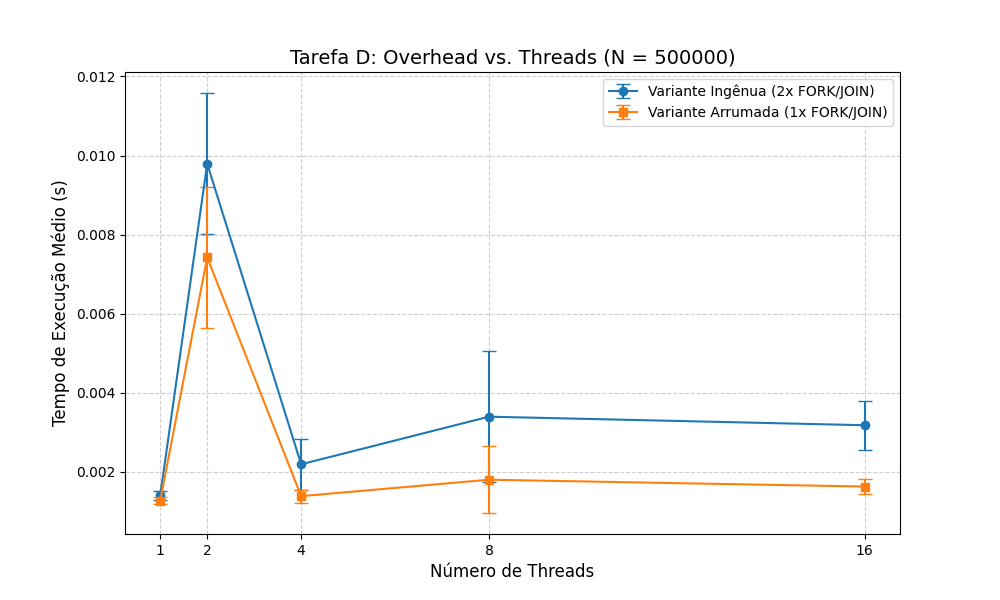
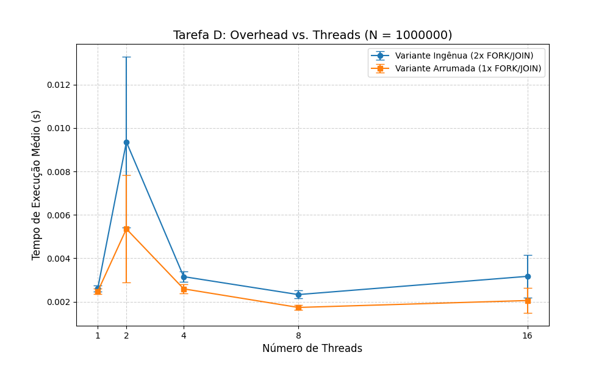
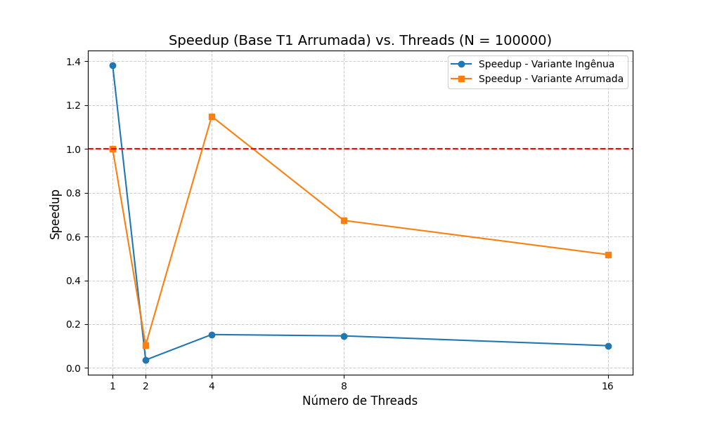
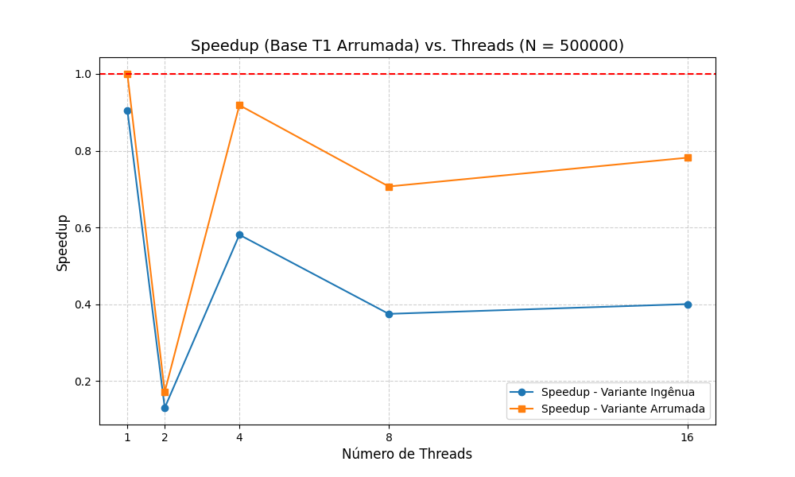
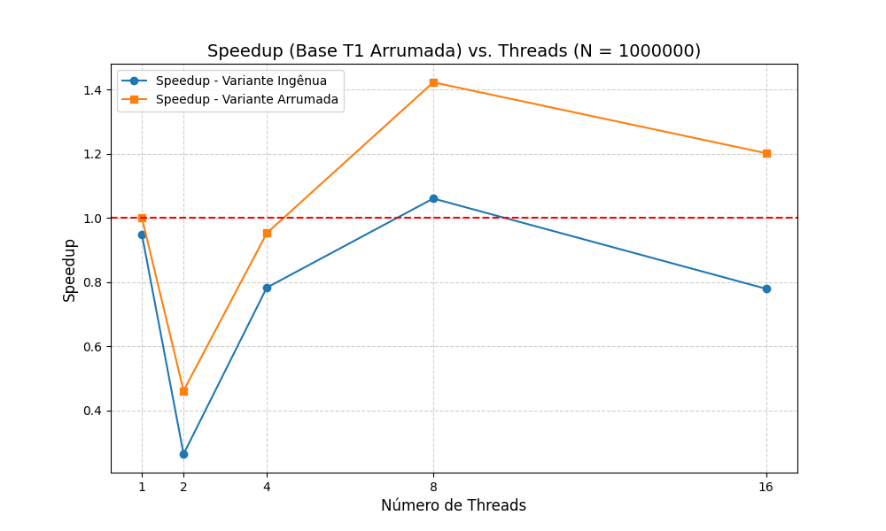

# RESULTADOS.md - Tarefa D: Organização de Região Paralela

Este documento apresenta a avaliação de desempenho das variantes **Ingênua** e **Arrumada** para as operações de soma e multiplicação de vetores, utilizando diferentes cargas de trabalho e densidades de threads.

## 1. Gráficos de Desempenho
Os gráficos gerados pelo script `plot.py` demonstram a evolução do tempo e do speedup em relação ao número de threads.

### Tempos de Execução (Absoluto)
* 
* 
* 

### Speedup Relativo
* 
* 
* 

---

## 2. Decisões de Schedule
Para ambos os kernels (soma e multiplicação), foi utilizado o **`schedule(static)`**.
* **Justificativa:** As iterações do laço realizam operações aritméticas idênticas e previsíveis. O escalonamento estático minimiza o overhead de coordenação entre as threads, o que é crucial em algoritmos *memory-bound* onde o custo de gerenciar tarefas dinâmicas superaria o tempo de processamento dos dados.

---

## 3. Análise Objetiva dos Resultados

### 3.1. Variante Ingênua vs. Arrumada
A **Variante Arrumada** apresentou um desempenho superior e mais estável que a Variante Ingênua em quase todos os testes. Isso comprova o custo proibitivo de abrir múltiplas zonas paralelas. Enquanto a variante ingênua executa o modelo *Fork-Join* duas vezes (criando e destruindo threads repetidamente), a variante arrumada mantém as threads ativas em uma única região, reduzindo drasticamente as chamadas de sistema e as barreiras redundantes.

### 3.2. Ganho de Eficiência com o aumento de N
Nota-se que o tempo médio demandado diminui proporcionalmente conforme o número de iterações ($N$) aumenta. Este fenômeno ocorre devido à **diluição do custo do overhead**. O custo fixo para criar e sincronizar o *pool* de threads permanece constante; ao aumentar o volume de iterações, esse custo torna-se percentualmente desprezível frente ao tempo total de computação útil.

### 3.3. Viabilidade do Speedup para N=1.000.000
O Speedup só apresentou valores acima de 1.0 na configuração de $N=1.000.000$. Isso demonstra que existe um "ponto de equilíbrio" onde a carga de trabalho é suficientemente grande para que as vantagens da execução paralela superem os custos de infraestrutura do OpenMP. Abaixo desse valor, a granularidade do problema é muito fina para justificar o uso de múltiplas threads.

### 3.4. O Pico de Tempo com 2 Threads
Observou-se um pico no tempo de execução ao utilizar 2 threads, tornando a performance pior do que na versão sequencial. Este comportamento é atribuído à **saturação da largura de banda de memória**. Como a soma e multiplicação são operações leves, o gargalo reside no transporte de dados da RAM para a CPU. Com duas threads competindo simultaneamente pelo barramento, ocorre contenção de recursos e um aumento no overhead de sincronização que o hardware não consegue compensar apenas com processamento.

---
