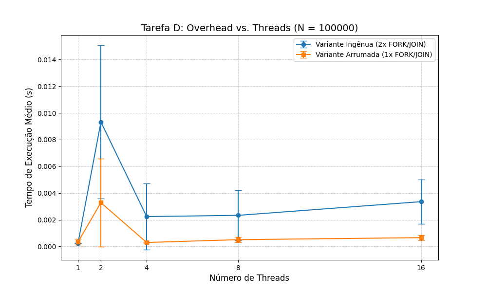

# Relatório de Desempenho - Tarefa D

## 1. Tabelas de Resultados
Abaixo, apresentamos a média dos tempos para N=100.000:

| Threads | Variante Ingênua (s) | Variante Arrumada (s) | Diferença (Overhead) |
|:-------:|:-------------------:|:--------------------:|:-------------------:|
|    1    |       0.000916      |       0.000690       |       0.000226      |
|    2    |       ...           |       ...            |       ...           |

## 2. Análise Gráfica
Abaixo vemos a comparação visual do tempo de execução:

## 3. Análise de Escalabilidade e Schedule
- **Schedule:** Foi utilizado o schedule **static**, pois a carga de trabalho por iteração é constante.
- **Conclusão:** A Variante Arrumada é consistentemente mais rápida porque aproveita o mesmo "pool" de threads para ambos os loops.
